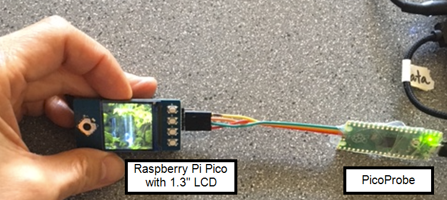
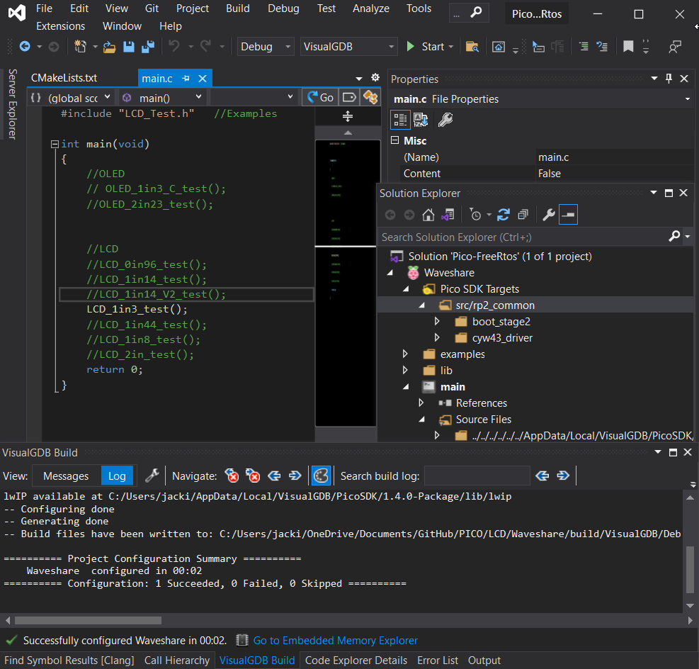

# Pico-FreeRtos
Raspberry Pi Pico Project with FreeRtos and VisualGDB (Work in Progress)

To start programming in C on the Raspberry Pi Pico, don't waste your time on youtube watching
videos on how to get started.
Download VisualGDB and save yourselve at least 20 hours of frustration.

Skills for this project:
- Embedded Debugging in Visual Studio Environment
- Amazon AWS FreeRtos
- IoT communications
- Interfacing with real world devices

